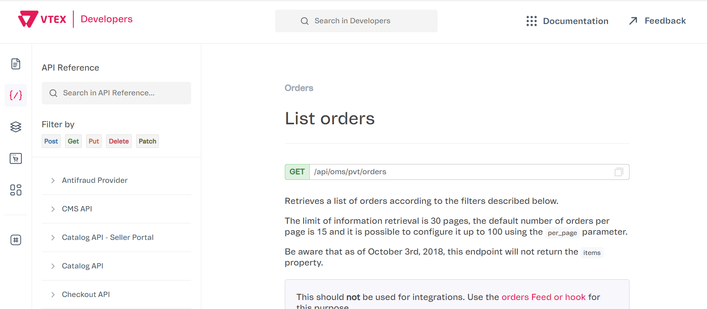
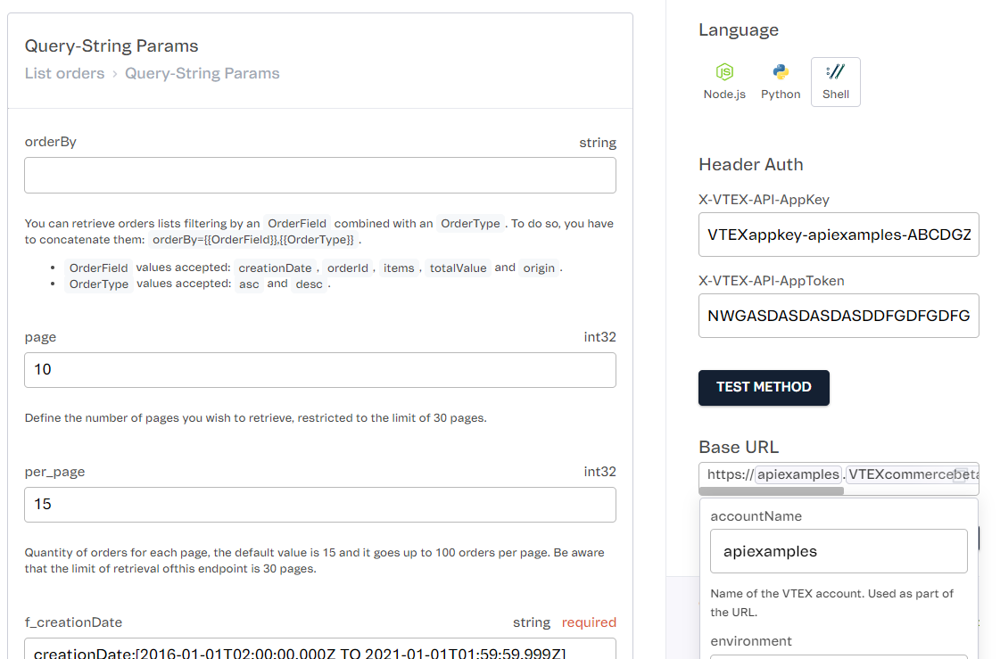
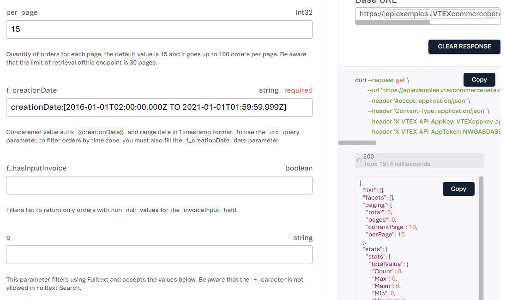
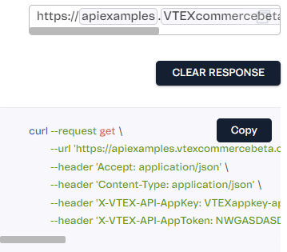

You can use the `TEST METHOD` button in [VTEX API reference](https://developers.vtex.com/docs/api-reference) to test API requests as you read the documentaion. In this tutorial you will learn how to use this feature.

## Before starting

Each request to VTEX APIs [must be authenticated](https://developers.vtex.com/docs/guides/getting-started-authentication). And to use the Developers Portal `TEST METHOD`, you must use [application keys](https://developers.vtex.com/docs/guides/getting-started-authentication#application-keys).

So before going forward with this tutorial, make sure you have a app key and token pair with the right [permissions](https://help.vtex.com/en/tutorial/roles--7HKK5Uau2H6wxE1rH5oRbc). If you do not have an app key and token pair, learn more about how to [create application keys](https://help.vtex.com/en/tutorial/application-keys--2iffYzlvvz4BDMr6WGUtet).

## Trying out a simple GET

>⚠️ The example below is based on the [List orders endpoint](https://developers.vtex.com/docs/api-reference/orders-api#get-/api/oms/pvt/orders), but these instructions apply for any endpoint you wish to try. Feel free to follow along.

To try out an API request follow these steps:

1. Head to the API reference page of the endpoint you wish to test, such as the [List orders endpoint](https://developers.vtex.com/docs/api-reference/orders-api#get-/api/oms/pvt/orders).

   

2. Read the documentation and fill in necessary parameters of your request, such as headers, query parameters, and request body fields.
3. Scroll to the `TEST METHOD` button. It may be on the top of the page at the right side of your screen, or on the bottom, depending on your window size.
4. Fill in your app key in the `X-VTEX-API-AppKey` field.
5. Fill in your app token in the `X-VTEX-API-AppToken` field.
6. Hover your mouse cursor over the `Base URL` field to see the `accountName` and `environment`.
7. Fill in the `accountName` field with your [VTEX account name](https://help.vtex.com/en/tutorial/what-is-an-account-name--i0mIGLcg3QyEy8OCicEoC).
8. Fill in the environment. If you do not know which environment to use, try `vtexcommercebeta`.

    

9. Click the `TEST METHOD` button. This will send your request to the desired API endpoint.
10. Check your response below the request.

If you get a `401 - Unauthorized` as response, review the [application key and token](https://developers.vtex.com/docs/guides/getting-started-authentication#application-keys) and try again. Make sure that the right [permissions](https://help.vtex.com/en/tutorial/application-keys--2iffYzlvvz4BDMr6WGUtet) are defined in the [roles](https://help.vtex.com/en/tutorial/roles--7HKK5Uau2H6wxE1rH5oRbc) and that you copied the exact key and token values into the headers of the request.

>ℹ️ Learn more about [VTEX authentication for developers](https://developers.vtex.com/docs/guides/getting-started-authentication).

If you received a `200 OK` response, it means you got your a successful request to VTEX APIs.

>ℹ️ Some API requests may return other status codes in case of success, such as `201 Created` or `204 No Content`.

## Using an API testing platform

You can export API specification or example requests to be used with [Postman](#using-postman) or the API platform of your choice.

### Request examples

As you fill in request parameters in VTEX API reference, as described above in steps 4 to 8, the request box is automattically updated. You can find this box below the `Base URL` field described above.

This means you can copy this content to be imported into other software.

Our API reference documentation is built using the [Open API 3.0 (OAS 3.0)](https://github.com/OAI/OpenAPI-Specification/blob/master/versions/3.0.0.md) standard. The OAS 3.0 schemas are available for [download](https://github.com/vtex/openapi-schemas) in our GitHub repository.

### Using postman

You can import our OAS API specification to [Postman](https://www.postman.com/product/api-client/) by [downloading the JSON schemas](#downloading-api-specifications) you are interested in and following [these instructions](https://learning.postman.com/docs/postman/collections/working-with-openAPI).

If you have copied a `cURL` [request example](#request-examples), you can also [import it into Postman as raw text](https://learning.postman.com/docs/getting-started/importing-and-exporting-data/#importing-data-into-postman).
