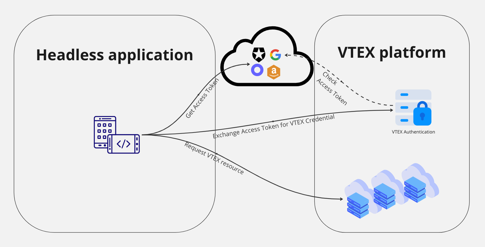

Building a headless ecommerce means setting up comunication between your frontend and VTEX's REST APIs. Each HTTP request sent from your frontend to VTEX must be authenticated with a [user token](https://developers.vtex.com/docs/guides/getting-started-authentication#user-token). The [implementation](#implementation) shown below describes how to obtain this token in your frontend.

>❗ This feature is currently being tested by a limited number of VTEX accounts. Please do not share this documentation with people outside of your operation.

>ℹ️ Learn more about [machine authentication in VTEX](https://developers.vtex.com/docs/guides/getting-started-authentication).

## Implementation

This is the flow of shopper authentication for headless VTEX stores:

1. The shopper authenticates themselves in your frontend via an [OAuth integration]().
2. Your frontend [exchanges the OAuth identity provider access token for a VTEX user token]().
3. Your frontend can now make requests to VTEX APIs using the obtained [user token]().